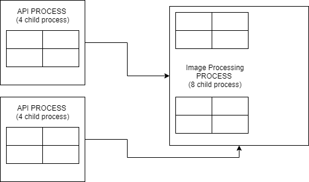

# Stock-Image-Service
It's an application to store stock images and the ability to search and view the images, based on queries,

The application built with three primary services
1. Fileserver (which can replaced with a S3 Bucket + CDN)
2. ImageProc Server (It's a standalone server responsible for storing image data and process it before storing)
3. API Server (it exposes the api and also interfaces with the database and the ImageProc server)

## Requirement (Dev or Build)

* Nodejs v12+
* Angular 8+ with latest cli installed 

## Build

### Backend
```
>> npm run build

```
### Frontend
```
>> npm run build:prod

or

>> ng build
```

## Deployment

```
>> cd backend_stock_service
>> npm run start:imageproc &

>> npm run start:api &

>> npm run start:fileserver &

```

* The api should be ideally launched after the imageproc but even if you dont the api service would repeatedly try to create a connection. While it does that all the upload request would fail.

* The application is configured using two files. The `.env` file which has all the environment variables. The `config` folder with `dev` , `production` and `test` settings.

* The application also requires a ssh pem key file with the supplied name of `keys.pem` and `keys`. These files should ideally be deleated from the server after deployment.


#### Deployment Strategy

* The api and imageproc applications are written for utilising the cluster module to distribute task. Although API module does not do much CPU intensive task except maintaining/searching an in memory cache inside it , the `imageproc` process can hugely benefit from clustered deployment.

* The library used `Sharp` link: [Sharp](https://sharp.pixelplumbing.com/) , already utilises `libvips` which natively runs in C and it's bindings are promisified plus the processing itslef is handled by the thread pool of `libuv` , keeping things fast. Which means it would perform well even without clustering. But clustering the application can allow us to utilise the individual core to it's fullest where we can also control distribution of new request.

* Clustering the `api` allows us to have each single request handling process get it's result from unique `imageproc` process. The application also uses a pool of socket connection which connects to individual imageproc processes automatically.

* Demo image



* The image proc can further be deployed in more virtual machines (if deployed in cloud) with a load balancer infront of the cluster to redirect and rebalance request.


## Decisions for development

* The application uses MySQL for storage and also as an indexing service for search functionality. To do away with manual SQL statements and overlooking security , I opted for using an ORM. I used `sequelize` which fits the requirement really well.

* Given the application is written in nodejs , to keep the sanity of the project I stuck to two primary practice  
    1. Use Typescript for compile time type safety and targetting the latest ES features supported by node.
    2. Use Inversify.js for Dependency Injection or IOC pattern. This allows me to decouple the code and also not worry about initialisation of objects and duplicated.
    3. Use Rxjs where there is usage of socket. It's easier to reason about streams and also manage them without keeping counters and manual arrays to keep track of them.

* Due to scale of the application I did not emphasized on writing interfaces for each of the classes which generally is the case , since the interfaces/abstracts are binded with their concrete.

* For the api development express combined with `express-inversify-util` is used. This allows easy controller declaration that does automatic route binding.

* All the environment variables are loaded from a  `.env` file. Currently it only supports one `.env` file. You cannot have sepparate for different mode of deployment. You must introduce new `.env` file or customize existing one for deployment.

* Authentication is done for only safeguarding the routes so that they are not abused. It's done through a JWT Tokens.

* The pem key files are used for signing the tokens and validating them.

* The application logs its activity using winston , and generates file for each independent unit of class objects. Like the `File` model class that contains code for committing and searching data creates it's own file for logging. This sepparates the logs and makes it easy to isolate any bug if there is associated with that module. All the logs are also redirected to console , so the console can be piped to write into a file also, acting unified log.

## Features 

### Upload


* The upload is enabled by `/upload/images`. The route is guarded by authentication from backend. Images are dropped if not met in specification. Each uploaded file makes independent call to back end for uploading. This disentagles the files and allows for partial success if the server crashes or fails to do the task in midway.

* The description also can be used to add extra hashtags e.g `#somethig` , these are then used for searching images by tag

* The images are kept in two version in the server on in 240p and other in 720p. the process is handled by `imageproc` and is not part of primary server. Hence crash in either of them will not hinder the processing of new request. Each data commit is given a 5s timeout which is configurable from config folder. This means if `imageproc` does not responds with affirmation it will be assumed commit did not happen and the mysql commit done will be reverted back. This is an implementation nuance, later on we can also afford to have request buffered so that server failure can be detected and be cached in temp location and uploaded back through `imageproc`, that's why the mysql request is made first. Also if database is down having file write request is redundant. 

* The level of parallelism for `imageproc` is dependent on the machine it's running on, as the application scale based on number of cpu if configured accordingly. The `api` application can also create pool of socket to all the subprocess of imageproc allowing for equal distribution of request. Although the implementation cycles between the sockets every .5s.

### Search


* User can search through description , tags and date range. These queries are exclusive i.e and-ed together except tags. Tags are or-ed. 

* Queries provided here are ran through some regex expression to find matches. From a security perspective this can open up a window for regex based dos attack. For safeguarding against that , the regex evaluation is contained inside promises which will timeout if it takes too long for evaluation.

* After the required data regarding description , date range and tags are extracted it is passed to the `File` model class.
Which organises all this for query through sequelize. 

#### Index

* Since search query requires to go through all the data it's better to identify rows that should be indexed. 
* Sequelize generates `createdAt` datestamp , on which index is set. 
* `Tags` in Hashtag table is kept as primary as they are unique, hence indexed.
* The field of name and description are kept as full text index, in mysql. MySQL lacks support for lemmetization and word roots, so a search like "some" for "something" may not yield results. This is not solved in current MySQL implementation. PostGreSQL has a better solution to this. But their usage is more complex than what MySQL offers.  

*Solution* : The problem with MySQL lacks of such word preprocessing can be solved from application end. A sepparate description preprocessor can create comma sepparated root word collection which then can be used for Full text index and be queries using boolean queries. (TF-IDF is used by MySQL). This will yield results as we may get from Postgres. 


## Image Processing

* The image processing server is implemented using the `ws` package along with `Rxjs` for managing socket connections. Eearlier I started with `net` package , as I thought a IPC over fifo files would be more efficient but it would also restrict the image processing to the same system where the api application lays.

* In order to do away with it , I resorted to using Websocket. The data passed to websocket is in binary format. The data passed are File Id and File Binary Blob. 

* The file id is a fixed unique UUID or 36 bytes , so the file id and the files are concatenated in binary array and passed through socket at once , and are unmarshalled at the otherend. For more complex data , Protobuf should be a explorable option. But since only these two data were sufficient I did not explored any other serialization.

* The Image is processed by `Sharp` library as mentioned before and is reasonably fast and easy to use. I have been able to upload simultaneous 16+ images in my home system with i7 4770 4th gen , 3.7Ghz 4 core - 8threads system. 

## API Performance

* The `Api` application in itself is not doing much CPU intensive computation except regex parsing. I have tried using worker threads but the cost of serialization + regex + deserialization in itself is greater and doesn't give any benefits.

* In order to utilise the CPU better , I employed an in memory cache through `node-cache` package. It uses Js Object internally so it has it's limitation of 1 million keys. Which works well for the purpose of quick lookup inside the application. The lookups are kept for reducing search queries. 

* The timeout for the keys is also based on how frequently the data is loaded. So a front page result is defacto will be loaded the most so no reason to have it being queried everytime from database. For queries that should lay at bottom of results have the lowest timeout time as they rarely will be visited and it's ideal to evict these objects from memory quickly. 

* When using Caching for single query 

┌─────────┬────────┬────────┬────────┬────────┬───────────┬───────────┬────────────┐
│ Stat    │ 2.5%   │ 50%    │ 97.5%  │ 99%    │ Avg       │ Stdev     │ Max        │
├─────────┼────────┼────────┼────────┼────────┼───────────┼───────────┼────────────┤
│ Latency │ 129 ms │ 169 ms │ 310 ms │ 373 ms │ 197.45 ms │ 168.47 ms │ 3056.28 ms │
└─────────┴────────┴────────┴────────┴────────┴───────────┴───────────┴────────────┘
┌───────────┬─────────┬─────────┬────────┬─────────┬────────┬────────┬─────────┐
│ Stat      │ 1%      │ 2.5%    │ 50%    │ 97.5%   │ Avg    │ Stdev  │ Min     │
├───────────┼─────────┼─────────┼────────┼─────────┼────────┼────────┼─────────┤
│ Req/Sec   │ 46      │ 46      │ 550    │ 602     │ 476.2  │ 161.56 │ 46      │
├───────────┼─────────┼─────────┼────────┼─────────┼────────┼────────┼─────────┤
│ Bytes/Sec │ 55.5 kB │ 55.5 kB │ 901 kB │ 1.28 MB │ 848 kB │ 420 kB │ 55.5 kB │
└───────────┴─────────┴─────────┴────────┴─────────┴────────┴────────┴─────────┘

Req/Bytes counts sampled once per second.